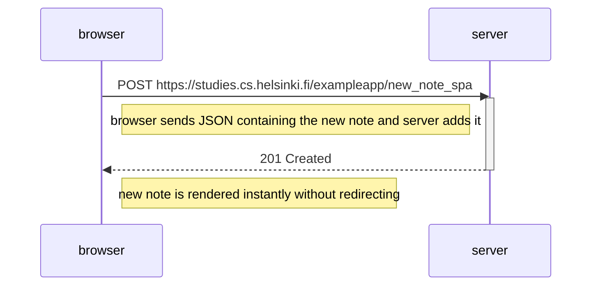

```mermaid
sequenceDiagram
  participant browser
  participant server

  browser->>server: POST https://studies.cs.helsinki.fi/exampleapp/new_note_spa
  activate server
  Note left of server: browser sends JSON containing the new note and server adds it
  server-->>browser: 201 Created
  deactivate server

  Note right of browser: new note is rendered instantly without redirecting
```
