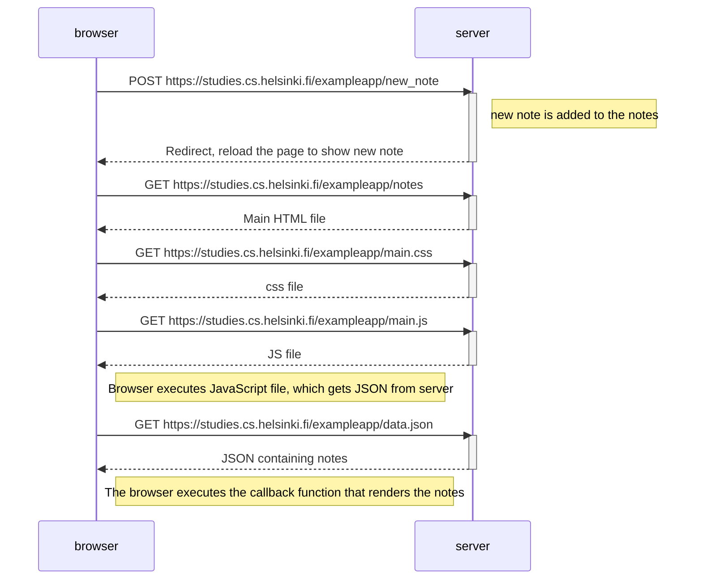

```mermaid
sequenceDiagram;
  participant browser;
  participant server;

  browser->>server: POST https://studies.cs.helsinki.fi/exampleapp/new_note
  activate server
  Note right of server: new note is added to the notes
  server-->>browser: Redirect, reload the page to show new note
  deactivate server

  browser->>server: GET https://studies.cs.helsinki.fi/exampleapp/notes
  activate server
  server-->>browser: Main HTML file
  deactivate server

  browser->>server: GET https://studies.cs.helsinki.fi/exampleapp/main.css
  activate server
  server-->>browser: css file
  deactivate server
  
  browser->>server: GET https://studies.cs.helsinki.fi/exampleapp/main.js
  activate server
  server-->>browser: JS file
  deactivate server

  Note right of browser: Browser executes JavaScript file, which gets JSON from server
  browser->>server: GET https://studies.cs.helsinki.fi/exampleapp/data.json
  activate server
  server-->>browser: JSON containing notes
  deactivate server
  
  Note right of browser: The browser executes the callback function that renders the notes 
```
